`single line CV:` Creator of [mordorjs](https://dev.to/pengeszikra/mdjs-mordorjs-1mon) and [TifY](https://dev.to/pengeszikra/terminal-is-your-friend-2b49) also [pipeline-operator](https://dev.to/pengeszikra/use-this-pipe-to-feel-the-flow-483j) fanatic. 🇭🇺

mental map: `1John1 + 5John17 |> 1Moses1 = (1Moses2 ... 4.22John21); alpha & omega = !![];`

<!--
**Pengeszikra/Pengeszikra** is a ✨ _special_ ✨ repository because its `README.md` (this file) appears on your GitHub profile.

Here are some ideas to get you started:

- 🔭 I’m currently working on ...
- 🌱 I’m currently learning ...
- 👯 I’m looking to collaborate on ...
- 🤔 I’m looking for help with ...
- 💬 Ask me about ...
- 📫 How to reach me: ...
- 😄 Pronouns: ...
- ⚡ Fun fact: ...
-->

<!-- THOUGHT-TREE:START -->

## ideas |> experiments |> code
*some repo rest in a while until I digit up again - Vibe Archeologist*

Those already mermaid graph follow the connections between my articles and the projects they became. Dates show when I wrote them; the branches show how the ideas connect. 
*Ideas representation generated by GPT-6*
`the source on DEV.TO`: [https://dev.to/pengeszikra](https://dev.to/pengeszikra)

### 01 · Read the flow. Learn by doing.

Pipeline experiments and terminal-first programming meet in a small learning tool.

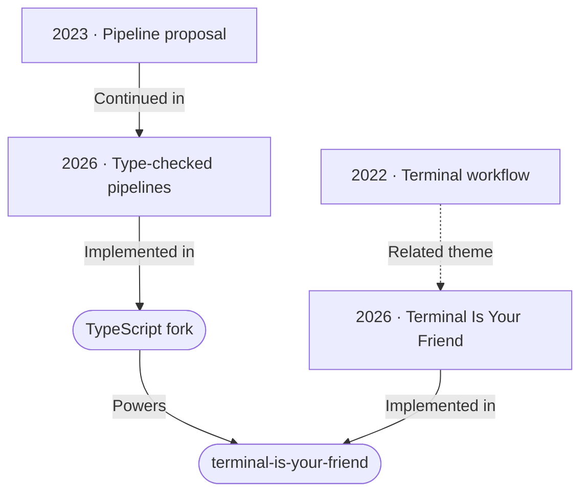

<table>
<tr>
<td width="290" valign="top"><a href="https://dev.to/pengeszikra/terminal-is-you-friend-4pna">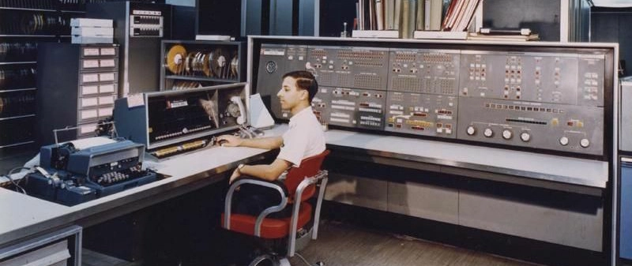</a></td>
<td valign="top">2022-08-09 <strong><a href="https://dev.to/pengeszikra/terminal-is-you-friend-4pna">Terminal is your friend</a></strong>
Making the terminal a comfortable part of everyday JavaScript and TypeScript work.
Related theme: <a href="https://dev.to/pengeszikra/terminal-is-your-friend-2b49">2026 · Terminal Is Your Friend</a>
<a href="https://dev.to/pengeszikra/terminal-is-you-friend-4pna">Read on DEV →</a>
</td>
</tr>
<tr>
<td width="290" valign="top"><a href="https://dev.to/pengeszikra/pipeline-operator-great-again-1cbn">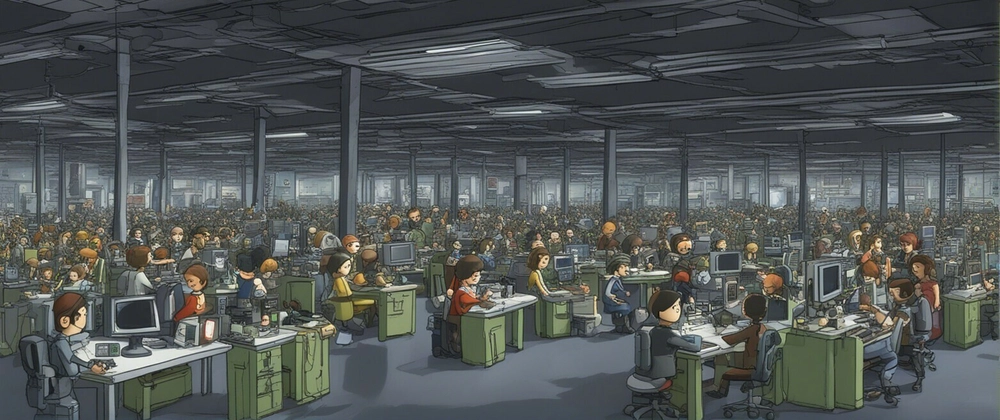</a></td>
<td valign="top">2023-09-29 <strong><a href="https://dev.to/pengeszikra/pipeline-operator-great-again-1cbn">Pipeline Operator great again!</a></strong>
A small proposal: pass a value into a function, then keep reading in the direction the data flows.
Continued in: <a href="https://dev.to/pengeszikra/use-this-pipe-to-feel-the-flow-483j">2026 · Type-checked pipelines</a>
<a href="https://dev.to/pengeszikra/pipeline-operator-great-again-1cbn">Read on DEV →</a>
</td>
</tr>
<tr>
<td width="290" valign="top"><a href="https://dev.to/pengeszikra/use-this-pipe-to-feel-the-flow-483j">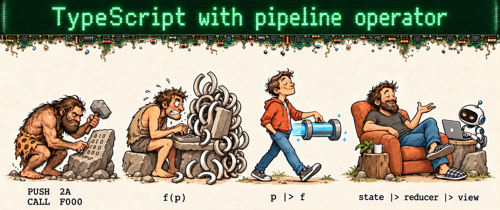</a></td>
<td valign="top">2026-09-30 <strong><a href="https://dev.to/pengeszikra/use-this-pipe-to-feel-the-flow-483j">I added a type-checked pipeline operator to TypeScript — including TSX</a></strong>
Returning to the idea with a working experimental TypeScript compiler, including TSX support.
Earlier idea: <a href="https://dev.to/pengeszikra/pipeline-operator-great-again-1cbn">2023 · Pipeline proposal</a> Implemented in: <a href="https://github.com/Pengeszikra/TypeScript">TypeScript fork</a>
<a href="https://dev.to/pengeszikra/use-this-pipe-to-feel-the-flow-483j">Read on DEV →</a>
</td>
</tr>
<tr>
<td width="290" valign="top"><a href="https://dev.to/pengeszikra/terminal-is-your-friend-2b49">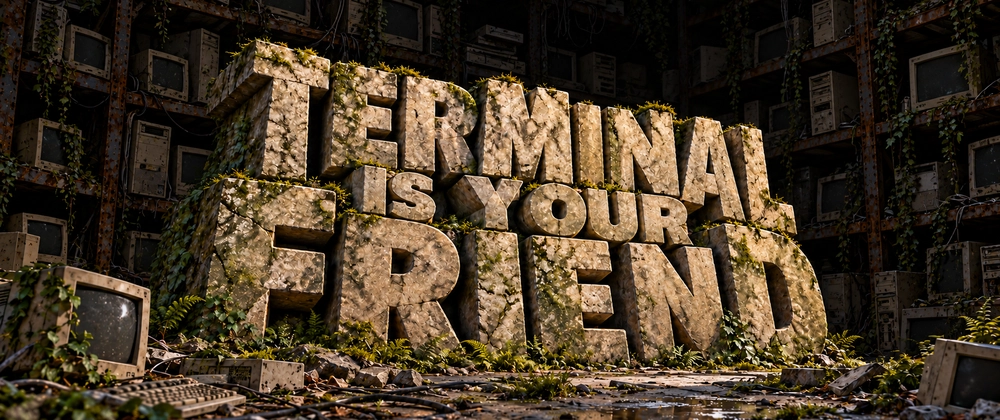</a></td>
<td valign="top">2026-10-04 <strong><a href="https://dev.to/pengeszikra/terminal-is-your-friend-2b49">Terminal is your Friend</a></strong>
A small programming playground for a friend. Learn the basics, run real code, and discover TypeScript and a tiny TSX interface along the way.
Earlier terminal writing: <a href="https://dev.to/pengeszikra/terminal-is-you-friend-4pna">2022 · Terminal workflow</a> Implemented in: <a href="https://github.com/Pengeszikra/terminal-is-your-friend">terminal-is-your-friend</a>
<a href="https://dev.to/pengeszikra/terminal-is-your-friend-2b49">Read on DEV →</a>
</td>
</tr>
</table>

**Explore the code:** [TypeScript fork](https://github.com/Pengeszikra/TypeScript) · [terminal-is-your-friend](https://github.com/Pengeszikra/terminal-is-your-friend)

### 02 · Useful types, small tools.

From typed React state to JSDoc, then into a playable game. These older experiments still explain the code.

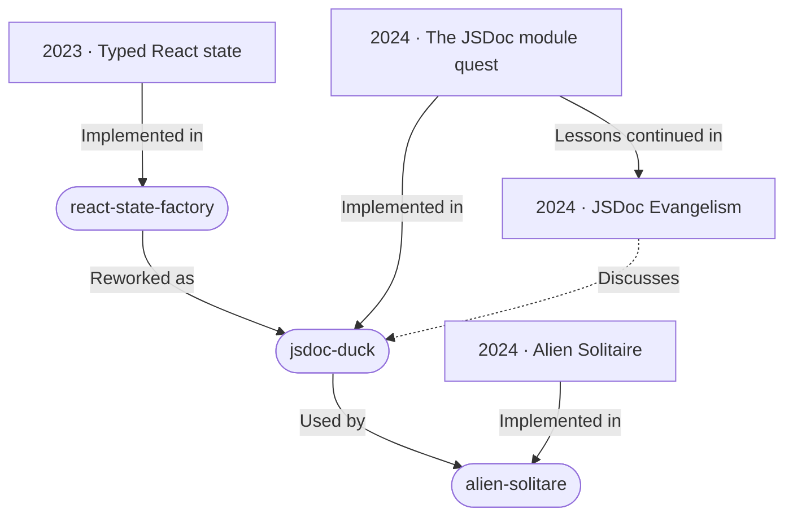

<table>
<tr>
<td width="290" valign="top"></td>
<td valign="top">2023-09-13 <strong><a href="https://dev.to/pengeszikra/simplify-your-react-state-management-with-react-state-factory-4a14">Simplify your React state management with react-state-factory</a></strong>
A small state-management library built around useReducer, typed actions and a straightforward dispatch API.
Implemented in: <a href="https://github.com/Pengeszikra/react-state-factory">react-state-factory</a>
<a href="https://dev.to/pengeszikra/simplify-your-react-state-management-with-react-state-factory-4a14">Read on DEV →</a>
</td>
</tr>
<tr>
<td width="290" valign="top"></td>
<td valign="top">2024-08-29 <strong><a href="https://dev.to/pengeszikra/jsdoc-npm-module-quest-2f7a">jsDoc npm module quest</a></strong>
Reworking react-state-factory in JavaScript with JSDoc, and finding the practical limits of publishing its types.
Implemented in: <a href="https://github.com/Pengeszikra/jsdoc-duck">jsdoc-duck</a> Lessons continued in: <a href="https://dev.to/pengeszikra/jsdoc-evangelism-1eij">2024 · JSDoc Evangelism</a>
<a href="https://dev.to/pengeszikra/jsdoc-npm-module-quest-2f7a">Read on DEV →</a>
</td>
</tr>
<tr>
<td width="290" valign="top"><a href="https://dev.to/pengeszikra/a-l-i-e-n-s-o-l-i-t-a-r-e-2kgc">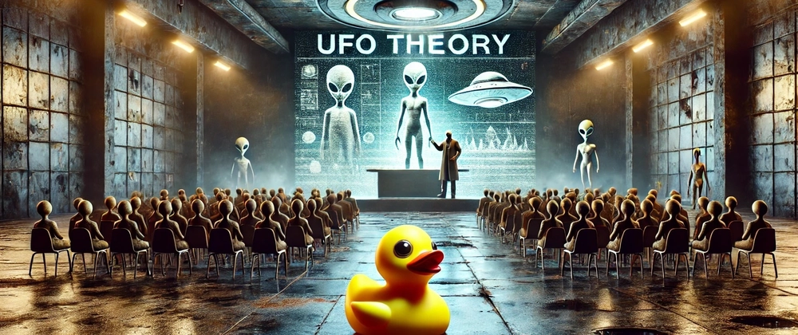</a></td>
<td valign="top">2024-09-29 <strong><a href="https://dev.to/pengeszikra/a-l-i-e-n-s-o-l-i-t-a-r-e-2kgc">A L I E N - S O L I T A R E</a></strong>
A playable card game that puts jsdoc-duck to work: typed state and actions in a real JavaScript application.
Implemented in: <a href="https://github.com/Pengeszikra/alien-solitare">alien-solitare</a>
<a href="https://dev.to/pengeszikra/a-l-i-e-n-s-o-l-i-t-a-r-e-2kgc">Read on DEV →</a>
</td>
</tr>
<tr>
<td width="290" valign="top"><a href="https://dev.to/pengeszikra/jsdoc-evangelism-1eij">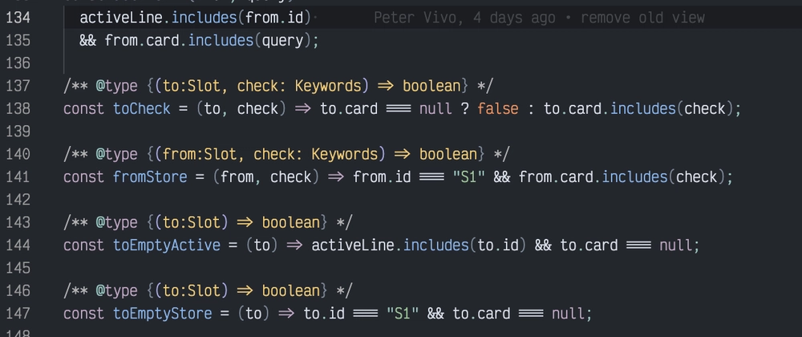</a></td>
<td valign="top">2024-10-27 <strong><a href="https://dev.to/pengeszikra/jsdoc-evangelism-1eij">JSDoc Evangelism</a></strong>
What working on legacy JavaScript and jsdoc-duck taught me about adding useful types without rewriting the application.
Earlier experiment: <a href="https://dev.to/pengeszikra/jsdoc-npm-module-quest-2f7a">2024 · The JSDoc module quest</a> Discusses: <a href="https://github.com/Pengeszikra/jsdoc-duck">jsdoc-duck</a>
<a href="https://dev.to/pengeszikra/jsdoc-evangelism-1eij">Read on DEV →</a>
</td>
</tr>
</table>

**Explore the code:** [react-state-factory](https://github.com/Pengeszikra/react-state-factory) · [jsdoc-duck](https://github.com/Pengeszikra/jsdoc-duck) · [alien-solitare](https://github.com/Pengeszikra/alien-solitare)

### 03 · Rust, WASM and things you can draw.

An early Rust learning note and a later drawing experiment. Shared curiosity; different projects.

<table>
<tr>
<td width="290" valign="top"><a href="https://dev.to/pengeszikra/rust-start-4klf">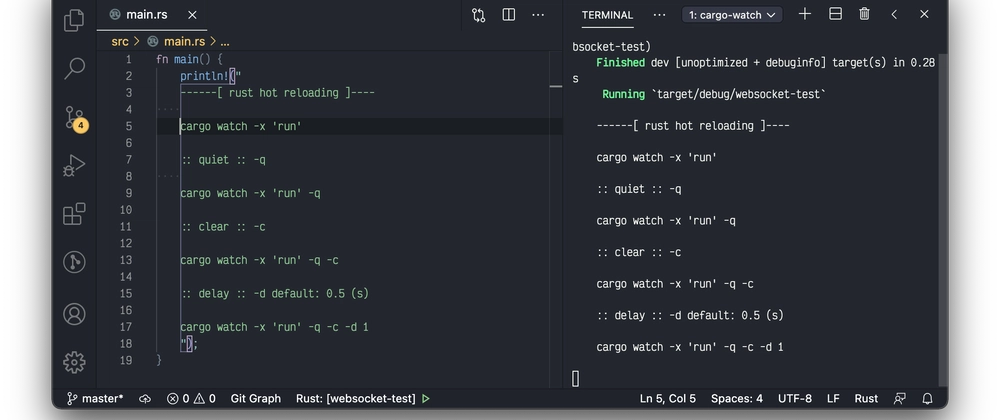</a></td>
<td valign="top">2020-11-28 <strong><a href="https://dev.to/pengeszikra/rust-start-4klf">rust start: hot reloading</a></strong>
An early notebook entry on getting started with Rust and hot reloading.
Related theme: <a href="https://dev.to/pengeszikra/rustroke-wasm-mini-draw-3oih">2026 · Rustroke</a>
<a href="https://dev.to/pengeszikra/rust-start-4klf">Read on DEV →</a>
</td>
</tr>
<tr>
<td width="290" valign="top"><a href="https://dev.to/pengeszikra/rustroke-wasm-mini-draw-3oih">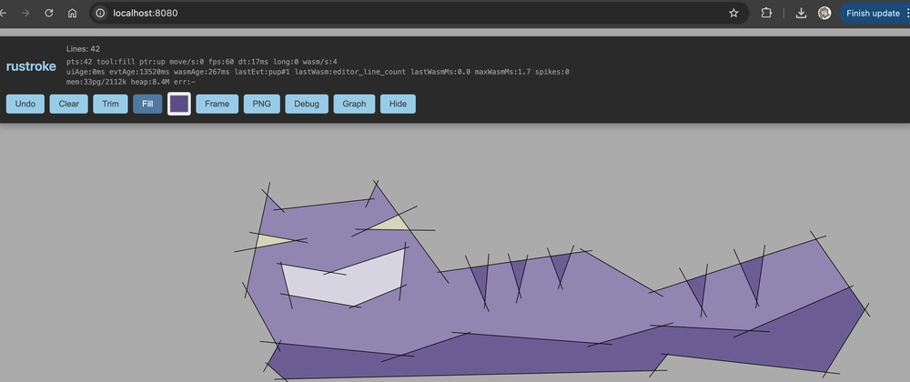</a></td>
<td valign="top">2026-02-15 <strong><a href="https://dev.to/pengeszikra/rustroke-wasm-mini-draw-3oih">Rustroke - WASM mini draw</a></strong>
A minimal drawing tool: draw free lines and fill the areas between them. A Rust/WASM geometry engine sits behind a simple HTML interface.
Earlier Rust writing: <a href="https://dev.to/pengeszikra/rust-start-4klf">2020 · Starting with Rust</a> Implemented in: <a href="https://github.com/Pengeszikra/rustroke">rustroke</a>
<a href="https://dev.to/pengeszikra/rustroke-wasm-mini-draw-3oih">Read on DEV →</a>
</td>
</tr>
</table>

**Explore the code:** [rustroke](https://github.com/Pengeszikra/rustroke)

### More from my notebook

Recent articles waiting for a place on the map.

<table>
<tr>
<td width="290" valign="top"><a href="https://dev.to/pengeszikra/llm-rpg-test-2026-4734">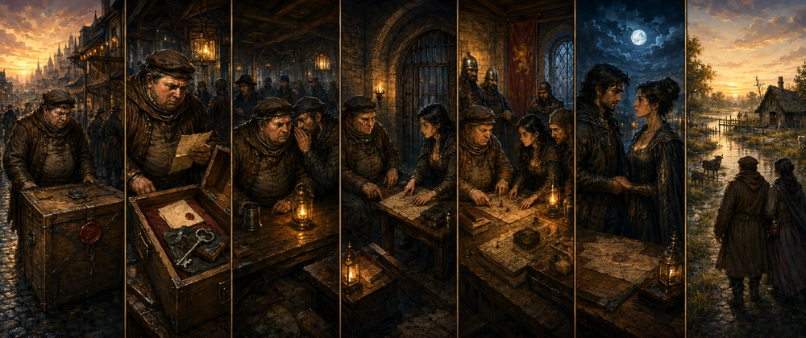</a></td>
<td valign="top">2026-05-06 <strong><a href="https://dev.to/pengeszikra/llm-rpg-test-2026-4734">LLM RPG test 2026</a></strong>
From time to time, I test the abilities of current LLMs with an RPG task. A relatively simple prompt...

<a href="https://dev.to/pengeszikra/llm-rpg-test-2026-4734">Read on DEV →</a>
</td>
</tr>
<tr>
<td width="290" valign="top"><a href="https://dev.to/pengeszikra/a-game-for-the-mind-2mj3">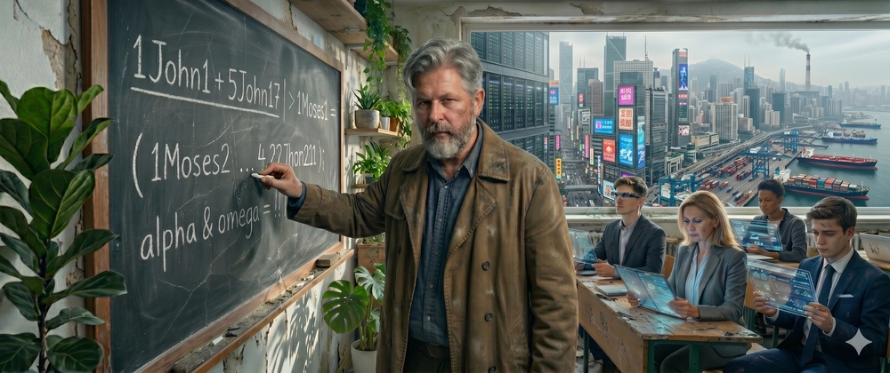</a></td>
<td valign="top">2026-04-18 <strong><a href="https://dev.to/pengeszikra/a-game-for-the-mind-2mj3">A Game for the Mind</a></strong>
Share your vision!   Please share your vision, how you can saw to planet bright or dark ...

<a href="https://dev.to/pengeszikra/a-game-for-the-mind-2mj3">Read on DEV →</a>
</td>
</tr>
<tr>
<td width="290" valign="top"></td>
<td valign="top">2026-04-14 <strong><a href="https://dev.to/pengeszikra/mcm-mordor-coffe-machine-42ap">MCM :: mordor-coffe-machine</a></strong>
<a href="https://dev.to/pengeszikra/mcm-mordor-coffe-machine-42ap">Read on DEV →</a>
</td>
</tr>
</table>

[All 39 articles on DEV](https://dev.to/pengeszikra)

Article images are copied from their original DEV posts. The map, article metadata and covers are maintained manually.

<!-- THOUGHT-TREE:END -->
